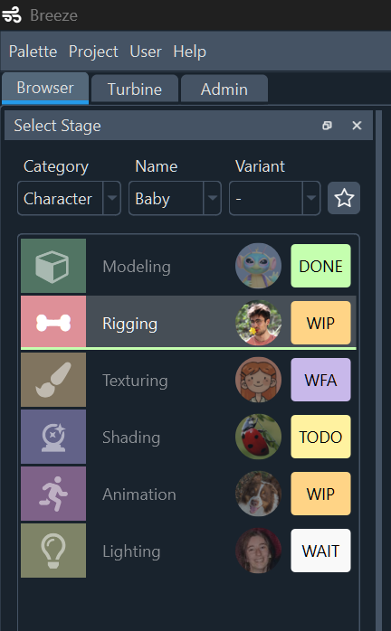

# Browser (Features)

The Browser is Breeze's main working window.
It is divided into multiple panels.

{width=700}

___
## Stage panel

A list of Stages to choose from, associated with the selected Asset.

{width=200, align=left}

- [Create Assets and add Stages to them](../how_to.md#create-assets)
- Select a Stage to work on
- [Assign Users and Statuses to a Stage](../how_to.md#assign-users-and-status-to-a-stage)
- Quick access to your recent and favourites Assets (todo)

 
 
 
 
 
 

___
## Ingredients panel

List of ingredients expected by a Stage, grouped by name.

{width=200, align=left}

- [Cast ingredients in the selected Stage](../how_to.md#cast-ingredients-in-a-stage)
- Swap the version number of an ingredient
- Autocast ingredients expected from the selected Stage (todo)
- Copy-paste ingredients between different Stages (todo)
- Group ingredients into folders to use them together somewhere else (examples: a character with its props, a shot's content, etc.) (todo)

___
## Work versions

List of all the work versions for the selected Stage

{width=200, align=left}

- [Open a working file](../how_to.md#select-and-open-a-version)
- See infos about the Stage's working Versions (user, comment, date, software, etc.)
- Create new Versions with en empty file
- Increment existing Versions
- Edit version comments
- [Execute Build, Update, Export and Reviews of a Version](../how_to.md#build-and-export-a-scene)

 
 
 

___
## Exports

Table of the Components that were exported from the selected Stage.

{width=200, align=left}

- The columns are the Component's names, and the rows are the Version numbers.
- For each possible Components, see if it was exported, and who exported it.