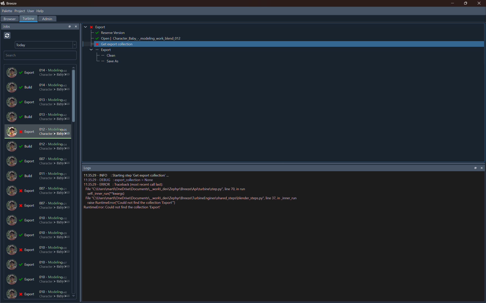

# Features

Breeze is made of multiple contexts. A context is accessible from its tab.

{width=300}

___

## [Browser](browser.md)

{width=400, align=left}
Create and manage files. Link them together and assemble them into a full project.

 
 
 
 
 

___

## [Turbine](turbine.md)

{width=400, align=left}

Turbine Engines history, with a clear visibility of sub-steps, successes and errors.
Quick access to Components exported from engines.

 
 
 
 
 

___

## [Admin](admin.md)
(todo)

- Create stage templates and recipe
- Assign processes to stage templates
