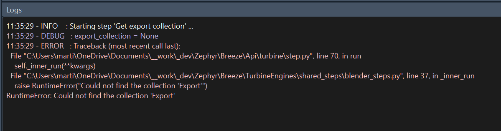

# Turbine (Features)

In Breeze, you can build, update, export and review scenes. 
Turbine assembles these actions from a series of Steps into an Engine.

The Turbine tab is a history of Engines, where you can clearly see what happened during each step.

[How to build and export a scene](../how_to.md#build-and-export-a-scene)

{width=700}
___
## Jobs Browser

{width=200, align=left}

A list of all the recent jobs, 
with detailed infos about its user, its document context and its timestamp.

The Jobs be filtered by user, by date or by text.

Select a Job to show its steps, or right-click it to relaunch it.

 
 
 
 
 
 
 
 
 

___
## Steps viewer

{width=500}

See each individual step from a Job, ordered.
Quickly understand whether they succeeded or not.
Click on a step to display its log.

___
## Log viewer

{width=500}

Detailed infos of a step using `infos`, `debug` and `error` logs.

