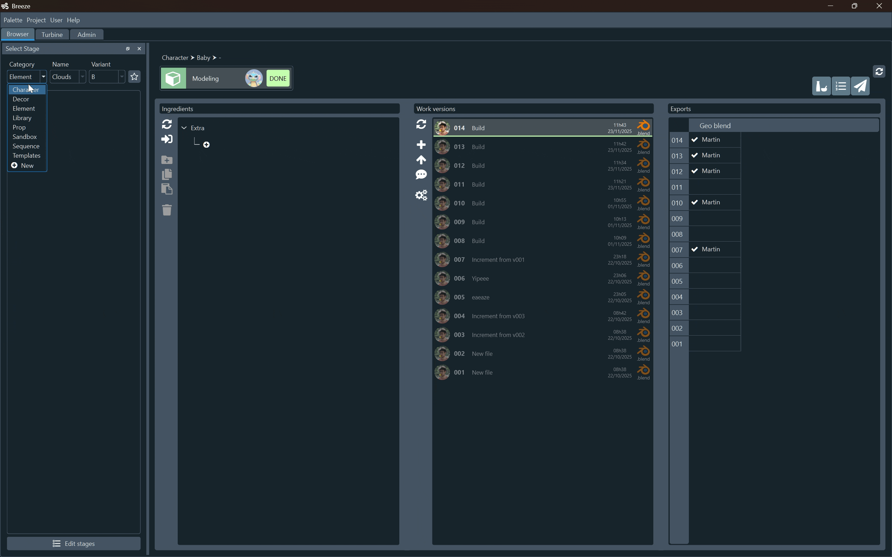
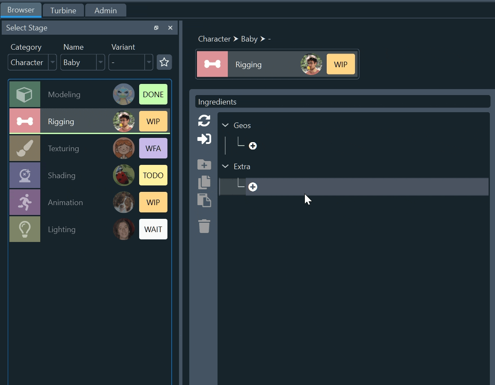
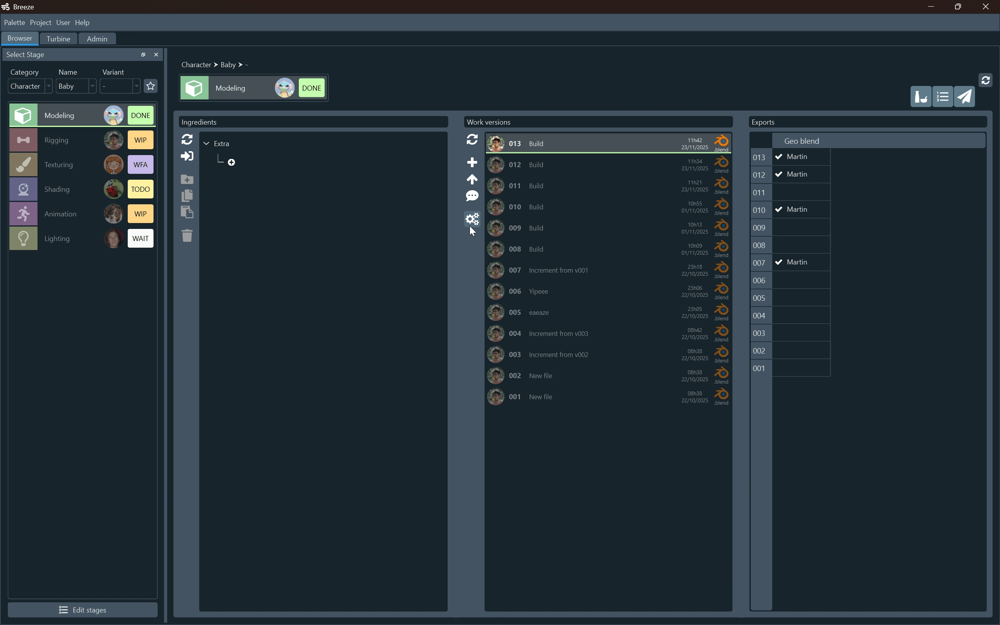

# How-to

### Select and open a Version

{width=400, align=left}

Navigate in the browser to select an Asset, a Stage and a Version.

Double-click on the version to open it.

 
 
 
 
 

___

### Create Assets

{width=300, align=left}

In `Browser > Stage Panel > Asset Selector`, click the `new` button in one of the dropdown menus:

  - **category**: adds an empty category to the project 
  - **name**: creates an asset in the selected category, with the default variant `-`
  - **variant**: creates a new variant for the asset with the selected category and name

!!! tip
    To create multiple Assets at once, check `Don't Close` in the popup

___ 

### Assign Users and Status to a Stage

{width=300, align=left}

Click the `User` or `Status` icon to open an Edit Popup. Left-click to confirm, or right-click to cancel.

 
 
 
 
 
 
 
 
 
 
 
 
 

___

### Cast ingredients in a Stage

{width=400, align=left}

Clik the `plus` button under an ingredient slot, and select a Component to cast.

!!! info "Ingredient filters"
    Ingredients are pre-filtered for a given slot.
    Example: in a rigging Stage, the slot `geo` only receives geo components.
    The `extra` slot can receive any ingredient from the project

!!! tip "Edit an existing ingredient"
    - click on it to replace it
    - click on its version number to cast another version from the same Component

___

### Build and export a scene

{width=400, align=left}

Select a Version and click the Gear icon in the toolbar.

From the `Turbine Launcher`, you can select another context or modify inputs for the upcoming Process.

When it is over, go to the `Turbine Tab` to see a list of your recent processes, with detailed steps, logs, successes and errors. 